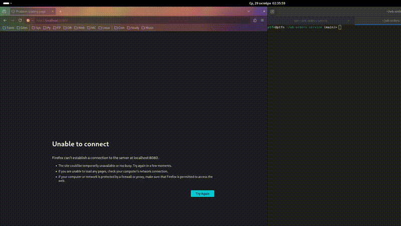

# WB Orders Service

## Запуск с Docker Compose

```bash
# Запуск всех сервисов
docker-compose up -d

# Остановка
docker-compose down

# Просмотр логов
docker-compose logs -f app
```

## Демонстрация


